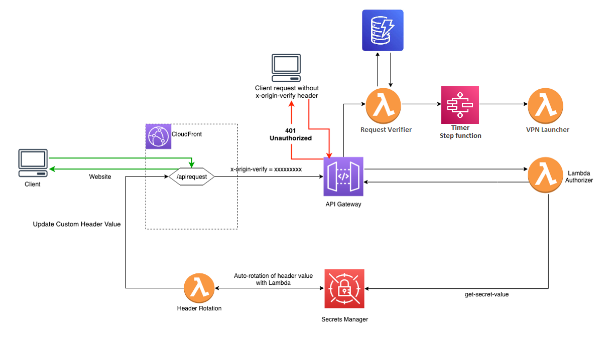

# Ninja VPN


Ninja VPN is a really simple volatile VPN server that uses Wireguard in an AWS ec2 instance. You will be able to connect to your own VPN through the common Wireguard client software.


## What to expect

Apply the terraform configuration in this repository and get the url of your website from the terraform output.

Access your Cloudfront url and request for your own VPN server.

### How the S3 website works

The website is a static website hosted in S3. It is a simple HTML form that will send a POST request to the API Gateway endpoint.

You will be identified by your email and the location you want your VPN server to be deployed. No registration is needed.


## How to use this repository

### Deploy the API

```bash
make tf-deploy TF_TARGET=api
```

### Deploy the VPN manually

Set parameters in config.yaml, including: email, timezone, region and countdown. Then run:
  
```bash
make tf-deploy TF_TARGET=vpn
```

## What this API solution consists of




## Contributing

Pull requests are welcome

## License

[BSL](LICENSE.txt)
